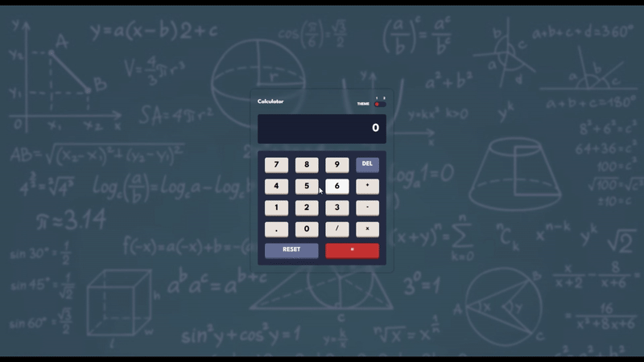

# 🧮 JS Calculator  
A responsive calculator with smooth animations, keyboard support, and modern UI.  

---

## 📸 Preview  

  

---

## 🚀 Live Preview  

🔗 [View Live Site](https://gamalhafez.github.io/js-calculator/)  

---

## ✨ Features  

- Perform basic arithmetic operations (+, −, ×, ÷)  
- Support for decimals & continuous calculations  
- Modern UI/UX – Smooth animations, responsive design, and clean layout  
- Light & Dark Themes – Switch seamlessly between two themes  
- Keyboard accessibility (calculate using your keyboard)  
- Performance Optimized – Efficient event handling and DOM updates  
- Simple and reusable functions  

---

## ⌨️ Keyboard Shortcuts  

| Key              | Action             |  
| ---------------- | ------------------ |  
| `0–9`            | Enter numbers      |  
| `.`              | Decimal point      |  
| `+ - * x / ÷`    | Operators          |  
| `Enter`          | Calculate result   |  
| `Backspace/Delete` | Delete last digit |  
| `c`              | Clear all          |  

---

## 🛠️ Tech Stack  

- **HTML5** – Semantic structure  
- **Sass (CSS3)** – Organized styles with variables & mixins  
- **JavaScript (ES6+)** – Logic, event handling, animations  
